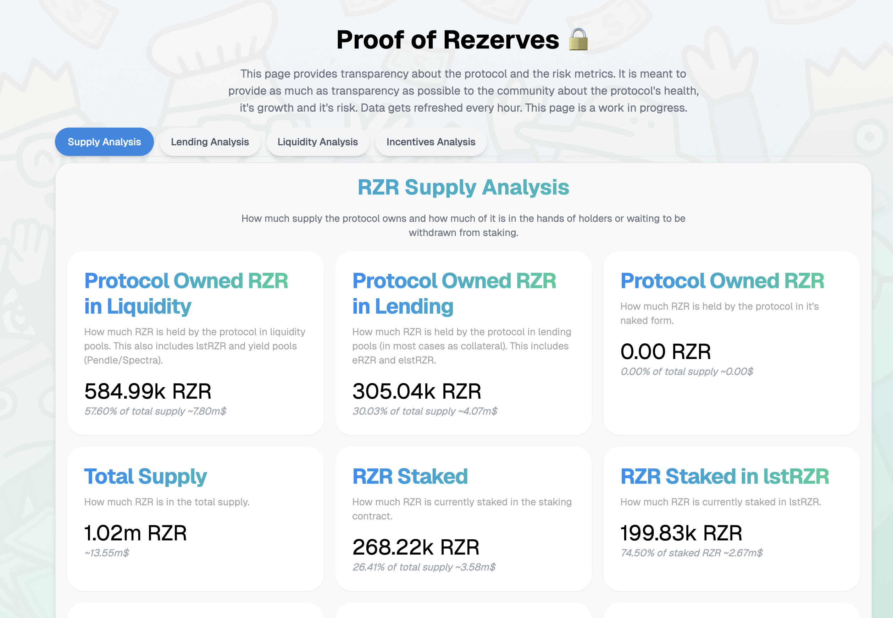

# Protocol Owned Supply

Protocol Owned Supply (POS) refers to the portion of a token’s circulating supply that is directly controlled by the protocol itself, rather than by external users or investors.

<figure><figcaption>
<a href="https://rezerve.money/risk">https://rezerve.money/risk</a> The RZR supply that the protocol owns and has deployed into liquidity can be seen in the supply analysis section in the risk page.
</figcaption></figure>

This creates a strategic reserve of assets that strengthens the protocol’s stability, sustainability, and long-term alignment with its community.

This supply can take multiple forms.

- The protocol may hold tokens as lending collateral, backing borrowing activity and liquidation mechanics.
- It can also own LP tokens, giving the protocol direct exposure to liquidity pools and ensuring that deep, stable liquidity exists for its users.
- In addition, supply can be deployed in staked positions such as Pendle markets, where it accrues yield and compounds over time.
- Finally, treasury holdings provide reserves that can be tapped for emergencies, growth incentives, or governance participation.

In an ideal scenario, the protocol should deploy all of it's idle RZR supply into lending markets or liquidity markets.

## Why Should the Protocol Own Supply?

A protocol that owns part of its own supply is directly invested in its own future. Unlike external actors who may be driven by short-term profit, the protocol always acts in its own long-term best interest — and by extension, in the best interest of its holders.

When the protocol holds supply, it becomes both the architect and the stakeholder, ensuring that decisions are guided by sustainability, stability, and growth rather than by external speculation.
